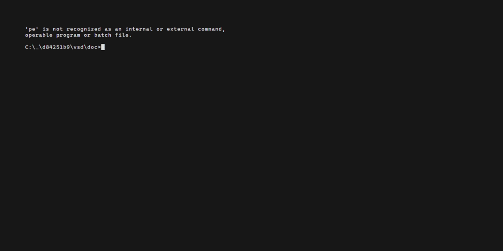

# VSD
The original motivation for `VSD` was a simple tooll to read `OutputDebugString` or just stdout, stderr for Windows gui applications (which by default don't print to the terminal.
Using `GDB` was slowing down the execution too much and [DebugView](https://learn.microsoft.com/en-us/sysinternals/downloads/debugview) can be hard to read if too many processes are writing messages.

Over time more features where added, the ability to attach to subprocesses and several possebilities to debug dll loading, which can be pretty hard for dnamically loaded libaries.

V(ery) S(imple) D(debugger) is not really a debugger but can help in times of need.

[Html log output for running kate](doc/kate.html)

### Help

```
Usage: vsd TARGET_APPLICATION [ARGUMENTS] [OPTIONS]
Options:
--vsd-separate-error             Separate stderr and stdout to identify stderr messages
--vsd-log logFile                Write the logFile in colored html
--vsd-log-plain logFile          Write a log plaintext to logFile
--vsd-all                        Debug also all processes created by TARGET_APPLICATION
--vsd-debug-dll                  Debugg dll loading
--vsd-log-dll                    Log dll loading
--vsd-no-console                 Don't log to console
--help                           Print this help
--version                        Print version and copyright information
```

### Debug dll loading
`--vsd-debug-dll` can be used to debug a missing dll of a dynamically loaded module.

#### Example 
```
kstars(9496): 2518:8c04 @ 00508890 - LdrpProcessWork - ERROR: Unable to load DLL: "brotlidec.dll", Parent Module: "C:\Users\hanna\Downloads\kstars\bin\freetype.dll", Status: 0xc0000135
kstars(9496): 2518:8760 @ 00508906 - LdrpLoadDllInternal - RETURN: Status: 0xc0000135
kstars(9496): 2518:8760 @ 00508906 - LdrLoadDll - RETURN: Status: 0xc0000135
kstars(9496): qt.qpa.plugin: Could not load the Qt platform plugin "windows" in "" even though it was found.
